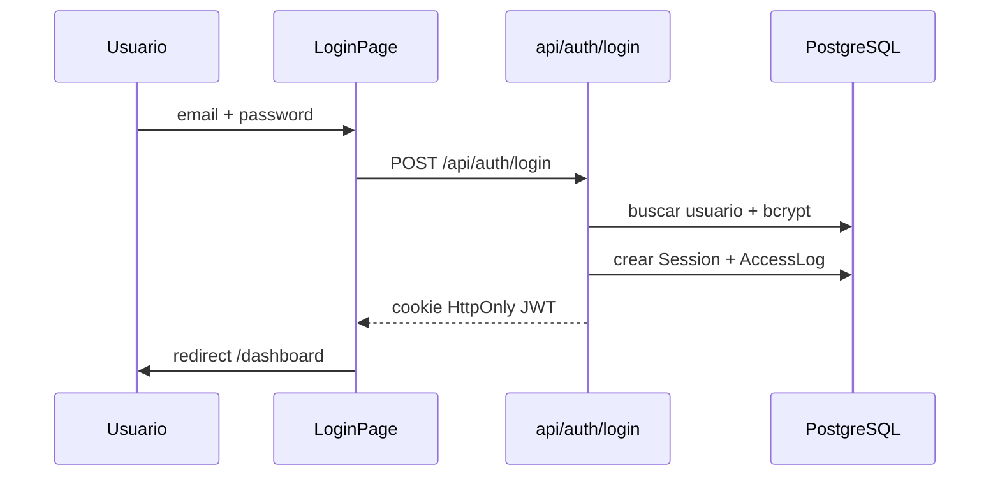
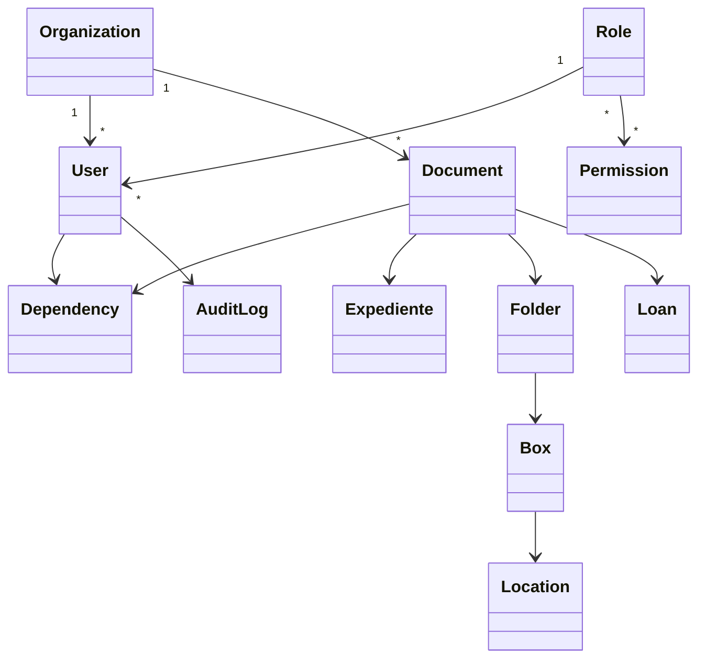

# Casos de uso por rol

## Super Administrador

- Autenticarse y ver panel global
- Administrar organizaciones, usuarios, roles y permisos
- Configurar parámetros, seguridad, backups y licencias
- Auditar toda la actividad del sistema
- Acceder a cualquier documento/expediente/dependencia

## Administrador de Gestión Documental

- Administrar TRD/TVD/CCD/PGD
- Crear y clasificar documentos y expedientes
- Gestionar archivo físico, cajas y carpetas
- Aprobar préstamos y transferencias
- Generar reportes e inventarios

## Jefe de Dependencia

- Supervisar solo su dependencia
- Crear documentos/expedientes del área
- Aprobar procesos internos y préstamos
- Consultar indicadores de su dependencia

## Usuario de Consulta

- Buscar y consultar documentos autorizados
- Escanear QR / código de barras
- Descargar documentos permitidos
- Ver historial y reportes de solo lectura

## Diagrama de secuencia — Login

## Diagrama de clases (simplificado)

